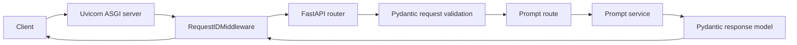

# AI Service API Learning Guide

This guide explains the project as it exists today. Its goal is not merely to
tell you which commands to run; it is to help you explain the design in an
interview, diagnose failures, and extend the service deliberately.

Use this guide together with the source code. Read one module, inspect the
linked files, answer its checkpoint questions without looking anything up, and
then verify your answers in [QUIZ_ANSWER_KEY.md](QUIZ_ANSWER_KEY.md).

## 1. Current project snapshot

The repository is a production-oriented Python backend foundation for a future
AI service. It currently provides:

- `GET /health`, a basic liveness endpoint.
- `POST /v1/prompts/inspect`, a deterministic prompt-metrics endpoint.
- Typed request, response, and environment configuration models.
- Unit/API tests using pytest and FastAPI's test client.
- Linting and formatting with Ruff.
- Reproducible dependency management with uv and `uv.lock`.
- A non-root, read-only Docker runtime.
- A Docker Compose development service with a health check.
- GitHub Actions checks for linting, formatting, tests, and image builds.
- Request-ID middleware implemented locally and covered by a test.

Important repository-state detail: at the time this guide was written, the
request-ID changes were present in the working tree but had not yet been
committed. The latest committed GitHub revision was `31071f9`.

This is already credible backend engineering work. It is not yet a complete AI
application because it does not call a model, retrieve knowledge, evaluate
model output, or track tokens, latency, and cost.

## 2. The system mental model

A client does not call the service function directly. A request passes through
several boundaries, each with a separate responsibility:



For `POST /v1/prompts/inspect`, the concrete path is:

1. Uvicorn accepts the HTTP connection.
2. Request-ID middleware creates a UUID and stores it on `request.state`.
3. FastAPI matches `/v1/prompts/inspect` to the prompts router.
4. Pydantic parses and validates the JSON body.
5. The route passes the validated string to the service layer.
6. The service calculates character and word counts.
7. FastAPI serializes the response model to JSON.
8. Middleware adds `X-Request-ID` to the response headers.

The separation matters because HTTP concerns, data contracts, and business
logic change for different reasons.

## 3. Repository map

```text
.
├── .github/workflows/ci.yml        # GitHub-hosted automation
├── .dockerignore                   # Files excluded from Docker build context
├── .env.example                    # Safe configuration template
├── .gitignore                      # Files Git must not track
├── .python-version                 # Python version requested by uv
├── Dockerfile                      # Production image recipe
├── compose.yaml                    # Local container runtime definition
├── pyproject.toml                  # Project and tool configuration
├── uv.lock                         # Exact resolved dependency graph
├── src/ai_service_api/
│   ├── api/routes/prompts.py       # HTTP endpoint definition
│   ├── middleware/request_id.py    # Cross-cutting request behavior
│   ├── schemas/prompts.py          # Input/output contracts
│   ├── services/prompts.py         # Domain calculation
│   ├── config.py                   # Typed environment settings
│   └── main.py                     # Application factory and composition root
└── tests/
    ├── test_config.py
    ├── test_health.py
    └── test_prompts.py
```

Empty `__init__.py` files mark directories as importable Python packages. They
do not need to contain classes or functions.

## 4. Python, packages, uv, and environments

Study [pyproject.toml](../pyproject.toml),
[.python-version](../.python-version), and [uv.lock](../uv.lock).

### What each file does

- `.python-version` requests Python 3.13 for local uv commands.
- `pyproject.toml` declares project metadata, supported Python, direct
  dependencies, development dependencies, and tool configuration.
- `uv.lock` records the complete, exact resolved dependency graph. It makes
  installations reproducible across machines and CI runs.
- `.venv` is the local environment containing installed packages. It is
  generated and must not be committed.

Runtime dependencies are required by the deployed application:

- FastAPI provides routing, dependency injection, OpenAPI generation, and
  request/response integration.
- Uvicorn is the ASGI server that runs the FastAPI application.
- pydantic-settings loads and validates runtime configuration.

Development dependencies support engineering work but are not needed by the
running production service:

- pytest executes tests.
- Ruff lints and formats Python.
- `httpx2` supports the current test-client stack.

### Commands you must understand

```bash
uv sync
```

Creates or updates `.venv` to match the project and lockfile.

```bash
uv sync --locked
```

Refuses to change the lockfile. CI uses this so an undeclared dependency change
cannot silently produce a different environment.

```bash
uv add PACKAGE
uv add --dev PACKAGE
```

Adds a runtime or development dependency and updates both project metadata and
the lockfile.

```bash
uv run COMMAND
```

Runs a command in the project environment without requiring manual activation.
Activating `.venv` is convenient but not required when using `uv run`.

### Checkpoint

- Why should `.venv` be ignored while `uv.lock` is committed?
- What failure is `uv sync --locked` designed to expose?
- Which dependencies belong in production, and which are development-only?

## 5. Application creation and dependency direction

Study [src/ai_service_api/main.py](../src/ai_service_api/main.py).

`create_app()` is an application factory. It creates and configures a new
FastAPI instance. The module-level `app = create_app()` gives Uvicorn a default
application to import.

The factory is valuable because tests can create isolated applications with
custom settings:

```python
test_client = TestClient(create_app(test_settings))
```

`main.py` is the composition root: it knows which routers, middleware, and
settings are assembled into the application. Business calculations should not
accumulate there.

The intended dependency direction is:

```text
main -> routes -> services
          |          |
          +-> schemas <-+
```

Services should not import FastAPI routers. Reversing that direction creates
tight coupling and makes business logic harder to test outside HTTP.

### Checkpoint

- Why export both `create_app` and `app`?
- What belongs in the composition root?
- Why should the service layer not know about HTTP status codes?

## 6. FastAPI routes and API design

Study
[src/ai_service_api/api/routes/prompts.py](../src/ai_service_api/api/routes/prompts.py).

`APIRouter` groups related endpoints. The router defines:

- Prefix: `/v1/prompts`
- Documentation tag: `prompts`
- Operation: `POST /inspect`
- Response contract: `PromptInspectionResponse`

The resulting public path is `/v1/prompts/inspect`. Versioning the API path
allows a future incompatible `/v2` contract without immediately breaking `/v1`
clients.

`POST` is appropriate because prompt content is submitted in a request body.
The current calculation is read-only, but prompt bodies can be long or
sensitive and should not be placed in query strings.

The route is deliberately thin. It accepts validated input, calls a service,
and returns the service result.

The health endpoint currently proves that the process can answer HTTP. It is a
liveness check, not a full readiness check: it does not verify a database,
queue, or model provider.

### Synchronous versus asynchronous endpoints

The prompt endpoint uses `def`, not `async def`. That is reasonable because its
calculation is short and contains no network waiting. Future model or database
calls should normally use asynchronous clients and `async def`, with explicit
timeouts.

Do not use `async` merely because the service is an API. Async improves
concurrency for waiting on I/O; it does not make CPU work faster.

### Checkpoint

- How are the router prefix and operation path combined?
- Why is the current service function synchronous?
- What is the difference between liveness and readiness?

## 7. Pydantic schemas and validation

Study
[src/ai_service_api/schemas/prompts.py](../src/ai_service_api/schemas/prompts.py).

Schemas are executable API contracts:

- `PromptInspectionRequest` requires a string between 1 and 10,000 characters.
- A field validator rejects whitespace-only prompts.
- `PromptInspectionResponse` guarantees non-negative counts.

`min_length=1` rejects `""`, but it does not reject `"   "`. That is why the
custom validator calls `value.strip()`.

Invalid request data produces HTTP 422 before the route function runs. This is
a boundary-validation principle: reject bad input before it reaches business
logic.

The response model is also valuable. It documents the response in OpenAPI and
prevents accidental output that violates the declared contract.

### Checkpoint

- Why was `min_length=1` insufficient?
- At what point is invalid JSON input rejected?
- Why validate output as well as input?

## 8. Service layer

Study
[src/ai_service_api/services/prompts.py](../src/ai_service_api/services/prompts.py).

`calculate_prompt_metrics()` contains deterministic domain logic:

- `len(prompt)` counts every character, including spaces.
- `prompt.split()` separates runs of whitespace, and `len(...)` counts words.

It has no dependency on Request, Response, APIRouter, or environment variables.
That makes it easy to call from a route, background worker, command-line tool,
or direct unit test.

The current service returns a Pydantic response object. As the domain becomes
larger, it may become preferable for services to return domain objects and let
the API layer map those objects to transport schemas. That extra separation is
not necessary yet.

### Checkpoint

- What makes this function deterministic?
- Why is deterministic logic easy to test?
- Which imports would signal that HTTP concerns are leaking into this layer?

## 9. Configuration and secrets

Study [src/ai_service_api/config.py](../src/ai_service_api/config.py) and
[.env.example](../.env.example).

`Settings` provides typed configuration with:

- An `AI_SERVICE_` environment-variable prefix.
- Optional local `.env` loading.
- UTF-8 decoding.
- Ignoring unrelated environment fields.
- An environment restricted to `development`, `test`, or `production`.

For example, `AI_SERVICE_APP_NAME` maps to `settings.app_name`.

`.env.example` contains safe examples and belongs in Git. `.env` may contain
local secrets and is ignored by both Git and the Docker build context.

Tests pass `_env_file=None` to prevent a developer's local `.env` file from
changing test results. `monkeypatch` temporarily changes an environment
variable and restores it after the test.

Never put a real API key in source code, `.env.example`, test fixtures, Docker
images, or Git history.

### Checkpoint

- Why does configuration use a prefix?
- Why do tests disable `.env` loading?
- What should be committed when adding a future model API key setting?

## 10. Middleware and request IDs

Study
[src/ai_service_api/middleware/request_id.py](../src/ai_service_api/middleware/request_id.py).

Middleware surrounds route execution and is appropriate for cross-cutting
behavior that should apply to many endpoints.

The current middleware:

1. Generates a UUID4 for each HTTP request.
2. stores it as `request.state.request_id` for downstream code.
3. calls the next application layer.
4. adds the ID to the `X-Request-ID` response header.

Request IDs help correlate a client-visible failure with server logs and future
model-provider calls. They are identifiers, not authentication credentials.

Current limitations to understand:

- The test checks header presence but not UUID validity or uniqueness.
- Incoming request IDs are not propagated.
- Logs do not include the ID yet.
- The middleware has not yet defined behavior for unexpected exceptions.

These are sensible next tests rather than reasons to overbuild the first
version.

### Checkpoint

- Why is request-ID behavior middleware instead of route logic?
- What does `request.state` provide?
- Why is checking only header presence a weak test?

## 11. Testing and test-driven development

Study [tests/](../tests).

The suite currently has eight test cases after the request-ID test is included:

- Two configuration tests.
- Three health/application tests.
- Three prompt tests, because the parameterized blank-prompt test produces two
  cases.

FastAPI's `TestClient` exercises routing, validation, middleware, serialization,
and response behavior without starting a real network server.

The request-ID feature followed the TDD loop:

1. Write a test for a missing header.
2. Run it and observe a meaningful failure.
3. Implement middleware and register it.
4. Run the targeted test until it passes.
5. Run the entire quality suite to catch regressions.

Useful pytest commands:

```bash
uv run pytest
uv run pytest tests/test_health.py
uv run pytest tests/test_health.py::test_response_includes_request_id
uv run pytest -q
```

A test is valuable when it can fail for the right reason. A test that passes
before implementation may be asserting the wrong behavior.

### Testing levels

- Unit test: exercises one function or class with minimal dependencies.
- Integration test: checks multiple components working together.
- End-to-end test: starts the deployed system and exercises it through its real
  external boundary.

The current API tests are lightweight integration tests. The manual `curl` and
container checks performed during development were closer to end-to-end smoke
tests.

### Checkpoint

- Why did the first request-ID test need to fail?
- Why does a parameterized test produce more than one test case?
- What behavior does `TestClient` cover that a direct service-function test
  would not?

## 12. Ruff and code quality

Ruff has two separate roles:

```bash
uv run ruff check .
uv run ruff format --check .
```

- `ruff check` detects lint violations such as undefined names, unsorted
  imports, selected bug patterns, and outdated Python syntax.
- `ruff format --check` verifies formatting without changing files.
- `ruff format` changes files to the canonical format.
- `ruff check --fix` applies safe lint fixes such as import ordering.

The configured rule families are `E4`, `E7`, `E9`, `F`, `I`, `B`, and `UP`.
They cover important style errors, Pyflakes correctness checks, import sorting,
bug-prone constructs, and Python syntax upgrades.

Formatting and linting overlap slightly but are not interchangeable. Code can
be formatted and still reference an undefined variable.

### Checkpoint

- Why does CI use `format --check` rather than `format`?
- What is the difference between fixing imports and formatting layout?
- Why should local checks match CI commands?

## 13. Git workflow

The commit history records small, understandable milestones:

```text
e833a3b  chore: initialize Python project
417a935  feat: add FastAPI health endpoint
7ac2861  build: add production Docker image
00c19b4  build: add Compose service definition
c2b540e  docs: add project setup and usage guide
67d32c4  feat: add typed application settings
8a4f191  feat: add prompt inspection endpoint
850ef78  fix: reject blank prompts
31071f9  ci: add automated quality checks
```

This history communicates intent. Conventional prefixes are useful shorthand:

- `feat`: user-visible capability.
- `fix`: correction to behavior.
- `test`: test-only change.
- `docs`: documentation.
- `build`: packaging or build system.
- `ci`: automation.
- `chore`: maintenance that fits no stronger category.

The safe review sequence is:

```bash
git status --short
git diff
git diff --check
git add PATHS
git diff --cached --check
git diff --cached --stat
git commit -m "type: concise description"
git push
```

The working tree, staging area, local repository, and remote repository are
four different states. `git add` copies changes into the staging area; it does
not commit or push them.

### Checkpoint

- What does the left-column `A` in `git status --short` mean?
- Why inspect `git diff --cached` before committing?
- What is the difference between `main` and `origin/main`?

## 14. Docker image design

Study [Dockerfile](../Dockerfile) and [.dockerignore](../.dockerignore).

The Docker build performs these stages:

1. Start from an exact Python 3.13 slim image.
2. Copy pinned uv executables from Astral's image.
3. Configure Python and uv runtime behavior.
4. Create `/app` as the working directory.
5. Create an unprivileged user with UID 10001.
6. Copy dependency files before source code for layer caching.
7. Install locked production dependencies without development tools.
8. Copy application source.
9. set `PATH` and `PYTHONPATH`.
10. switch to the non-root user.
11. declare port 8000 and start Uvicorn.

Security and reliability choices:

- `USER appuser` limits damage if the process is compromised.
- `PYTHONUNBUFFERED=1` makes logs appear immediately.
- `PYTHONDONTWRITEBYTECODE=1` avoids runtime `.pyc` writes.
- `--locked` enforces dependency reproducibility.
- `.dockerignore` keeps secrets, Git history, caches, and tests out of the build
  context.

`EXPOSE 8000` documents the intended port but does not publish it. Publishing
is done by `docker run -p` or Compose's `ports` mapping.

Layer ordering is a performance optimization: source edits do not invalidate
the expensive dependency-install layer unless `pyproject.toml` or `uv.lock`
changes.

### Checkpoint

- Why copy dependency files before source code?
- Why are pytest and Ruff absent from the production environment?
- What is the difference between an image and a container?

## 15. Compose, Colima, and Docker

Study [compose.yaml](../compose.yaml).

On this Mac, the layers are:

```text
Docker CLI / Docker Compose
            |
        Docker API
            |
      Docker Engine
            |
     Colima-managed VM
            |
           Lima
            |
          macOS
```

- Lima manages Linux virtual machines on macOS.
- Colima configures a lightweight VM and container runtime using Lima.
- Docker Engine builds images and runs containers inside that Linux VM.
- Docker CLI sends individual commands to the engine.
- Docker Compose applies a multi-container application definition. This project
  currently defines one service, but Compose still provides repeatable runtime
  settings.

Compose hardening includes:

- `init: true` for signal forwarding and child-process cleanup.
- `read_only: true` so the container filesystem cannot be modified normally.
- `tmpfs: /tmp` for permitted temporary writes in memory.
- A health check that calls `/health` with Python's standard library.
- Port mapping from host 8000 to container 8000.

Useful commands:

```bash
colima start
docker compose config --quiet
docker compose up --build --wait
docker compose ps
docker compose logs api
docker compose down
```

### Checkpoint

- Where does the Linux Docker Engine run on this Mac?
- Why can a read-only container still use `/tmp`?
- What additional behavior does Compose provide beyond `docker build`?

## 16. Continuous integration

Study [.github/workflows/ci.yml](../.github/workflows/ci.yml).

CI runs after pushes to `main` and for pull requests. GitHub creates a fresh
Ubuntu runner and performs:

1. Repository checkout.
2. uv installation with caching.
3. Python installation.
4. Locked dependency synchronization.
5. Ruff linting.
6. Ruff formatting verification.
7. pytest execution.
8. Docker image build.

The runner is not your laptop. Local commands rehearse the same checks, while
GitHub independently proves the repository can build in a clean environment.

`permissions: contents: read` follows least privilege. The uv action is pinned
to an exact commit SHA, reducing the risk that a mutable tag unexpectedly
changes executed code.

CI is only as useful as its checks. It does not currently deploy the service,
scan the image, measure coverage, run static type checking, or execute model
evaluations.

### Checkpoint

- Why can code pass locally but fail in CI?
- Why build the Docker image in CI even when tests pass?
- What does least privilege mean for workflow permissions?

## 17. Known gaps and next engineering milestones

These are learning opportunities, not hidden failures.

### Documentation and metadata cleanup

- Replace `"Add your description here"` in `pyproject.toml`.
- Update the README project tree to show routes, schemas, services, middleware,
  configuration, tests, and CI.
- Add the request-ID capability after it is committed.

### Backend reliability

1. Strengthen request-ID tests for valid UUIDs and uniqueness.
2. Add structured JSON logs containing request ID, method, path, status, and
   duration.
3. Define consistent error-response schemas and exception handlers.
4. Add a static type checker.
5. Add test coverage reporting with an intentional threshold.
6. Separate liveness and readiness when external dependencies exist.

### AI-engineering progression

1. Define an LLM client protocol independent of any provider SDK.
2. Implement a deterministic fake provider for tests.
3. Add a real asynchronous provider with explicit timeouts.
4. Classify retryable versus permanent errors; use bounded retries with
   backoff and jitter.
5. Return structured model output validated by Pydantic.
6. Track request latency, model, token usage, and estimated cost.
7. Create a versioned evaluation dataset and measurable quality criteria.
8. Add retrieval only when a concrete use case requires external knowledge.
9. Add caching, rate limiting, queues, and idempotency as actual load and
   failure requirements emerge.

Do not add every technology at once. Each milestone should have a failing test,
an implementation, documentation, and a focused commit.

## 18. What you should be able to explain in an interview

Without opening the repository, practice answering:

1. Walk me through a prompt request from TCP connection to JSON response.
2. Why did you choose a `src` layout and an application factory?
3. How do you keep environments reproducible?
4. Where does validation occur, and why reject blank prompts separately?
5. Which tests are unit, integration, and end-to-end?
6. How is the production container hardened?
7. What does CI prove, and what does it not prove?
8. How would you add an external model call safely?
9. How would you prevent duplicate or excessively expensive AI requests?
10. How would you evaluate an AI response when exact equality is inappropriate?

A strong answer includes a decision, the tradeoff, a failure mode, and how you
tested or observed it.

## 19. Four-week mastery plan

### Week 1: Explain the existing backend

- Draw the request flow from memory.
- Explain every top-level file in one sentence.
- Re-run targeted and full tests.
- Complete quiz sections A and B.

### Week 2: Runtime and delivery

- Explain uv, lockfiles, Docker layers, Compose, Colima, and CI.
- Rebuild the image without relying on memorized commands.
- Complete quiz sections C and D.

### Week 3: Reliability

- Finish and commit request IDs.
- Add structured logging through TDD.
- Study latency, throughput, timeouts, retries, and idempotency.
- Complete scenario questions.

### Week 4: First model boundary

- Define a provider-neutral interface and fake implementation.
- Test success, timeout, rate-limit, and malformed-output cases.
- Add a real provider only after tests define the contract.
- Begin a small evaluation dataset.

Continue LeetCode separately for 30-45 minutes per day. Backend project work
teaches architecture and delivery; algorithm practice teaches problem-solving
patterns and interview communication. Neither substitutes for the other.

## 20. Command reference

```bash
# Environment
uv sync
uv run python --version

# Local server
uv run uvicorn ai_service_api.main:app --app-dir src --reload

# Quality
uv run ruff check .
uv run ruff format --check .
uv run pytest
git diff --check

# Containers
colima start
docker build --tag ai-service-api:dev .
docker compose config --quiet
docker compose up --build --wait
docker compose ps
docker compose down

# Git review
git status --short
git diff
git diff --cached --check
git diff --cached --stat
git log --oneline --decorate -10
```

Do not memorize commands as magic phrases. For every flag, be able to say what
state it reads, what state it changes, and what a successful or silent result
means.

## 21. Quiz

Answer these without running the application. Write short reasoning, not only a
letter. The answer key is separate so you can test yourself honestly.

### A. Foundations and architecture

1. What process accepts the HTTP connection before FastAPI handles routing?
2. Why is `calculate_prompt_metrics()` not implemented directly in the route?
3. What is the purpose of every `__init__.py` file in this repository?
4. Why does the project export `app = create_app()`?
5. Trace a valid prompt request through at least six components.
6. Which layer should decide that a blank prompt is invalid?
7. Which layer should calculate word count?
8. What would be wrong with importing the prompts router from the service?

### B. Python, validation, and testing

9. What is the difference between `pyproject.toml`, `uv.lock`, and `.venv`?
10. Why does CI use `uv sync --locked`?
11. Why does `Field(min_length=1)` allow three spaces?
12. What HTTP status is returned for an invalid prompt, and does the route run?
13. Why does the suite report three prompt tests although the file defines only
    two test functions?
14. Is `TestClient` testing only `calculate_prompt_metrics()`? Explain.
15. What did the intentionally failing request-ID test prove?
16. How would you strengthen the current request-ID assertion?

### C. Docker, Compose, and CI

17. Explain image versus container in one sentence each.
18. Why does the Dockerfile copy `pyproject.toml` and `uv.lock` before `src`?
19. Why is the application process UID 10001 instead of root?
20. Does `EXPOSE 8000` make the API reachable from the host?
21. What is the purpose of `.dockerignore`, and how does it differ from
    `.gitignore`?
22. What do Lima, Colima, Docker Engine, Docker CLI, and Compose each do?
23. Why can the container use `/tmp` while its root filesystem is read-only?
24. Where does GitHub Actions execute this project's CI commands?
25. Why does CI build the image after Python tests pass?

### D. Git and operations

26. Explain working tree, staging area, local repository, and remote repository.
27. What does a silent `git diff --check` mean?
28. If `HEAD -> main` is one commit ahead of `origin/main`, what action remains?
29. Why should secrets be absent from both Git and the Docker build context?
30. Why is a request ID useful but not a security credential?

### E. Scenarios

31. The endpoint works locally but CI cannot import `ai_service_api`. Name two
    configuration areas you would inspect first.
32. A model provider sometimes hangs for five minutes. What controls should be
    added before retrying the request?
33. A client retries a request after a timeout and is charged twice. Which
    distributed-systems concept addresses this?
34. All tests pass, but the Docker image fails at startup. Give three plausible
    reasons the tests did not expose the problem.
35. A model response is valid JSON but factually wrong. Why is ordinary schema
    validation insufficient, and what additional mechanism is needed?

### Practical exercises

1. Draw the architecture without copying the diagram.
2. Predict the response to an empty prompt, a whitespace-only prompt, and a
   four-word prompt before running tests.
3. Explain every Dockerfile instruction aloud.
4. Write a test that validates the request-ID header as a UUID.
5. Write a test that proves two requests receive different IDs.
6. Describe a fake LLM provider contract without installing any provider SDK.

Use [QUIZ_ANSWER_KEY.md](QUIZ_ANSWER_KEY.md) only after completing a section.
